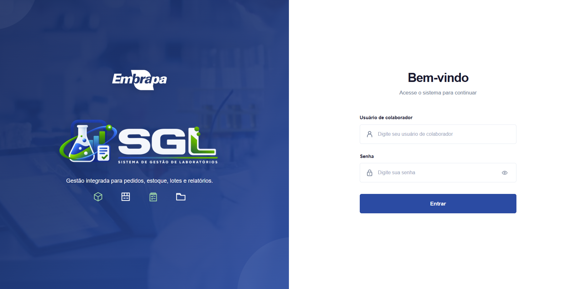

<a id="readme-top"></a>

<div align="center">
  <a href="https://github.com/gbsalermo/SGL-FRONTEND">
    
  </a>

# SGL — Sistema de Gestão de Laboratórios

**Frontend corporativo para pedidos, estoque, lotes, movimentações, relatórios e administração laboratorial.**

[Backend](https://github.com/gbsalermo/Sistema-SGL) · [Continuidade](CONTINUIDADE.md) · [Inventário de telas](docs/INVENTARIO_TELAS.md) · [Arquitetura](docs/ESTRUTURA_FRONTEND.md)

</div>

---

## 📍 Estado atual

O backend estrutural do SGL está concluído e o frontend está na **Etapa 3 — Interfaces reais**.

```text
Etapa 0 — Handoff backend → frontend                    ✅
Etapa 1 — Fundação visual/técnica essencial             ✅
Etapa 2 — Bootstrap técnico                             ✅
Etapa 3.1 — Login                                       ✅
Etapa 3.2 — Pedidos do Solicitante                      ⏳ PRÓXIMO
```

A estratégia atual abandonou a ideia de concluir todo o Figma antes do código.

Fluxo oficial:

```text
protótipo aprovado
→ implementação real
→ extração de componentes quando houver responsabilidade/repetição real
→ validação
→ próxima tela
```

---

## 🔐 Login final

A primeira interface real do frontend foi concluída na branch:

```text
feat/login-interface
```

### Apresentação

### Interface Login
<p align="center">
  
</p>

### Direção visual aprovada

```text
layout aproximadamente 50/50

ESQUERDA
→ fotografia de laboratório com tablet como contexto
→ overlay azul institucional forte
→ Embrapa
→ marca oficial SGL
→ frase institucional
→ quatro ícones auxiliares

DIREITA
→ fundo branco
→ Bem-vindo
→ Acesse o sistema para continuar
→ usuário de colaborador
→ senha
→ Entrar
```

O resultado segue a linguagem institucional do Publica/Embrapa, evitando card grande, excesso de decoração ou repetição da marca SGL no lado do formulário.

### Estrutura do módulo de autenticação

```text
src/modules/auth/
├── components/
│   ├── LoginBrandPanel.vue
│   └── LoginAccessForm.vue
└── views/
    └── LoginView.vue

src/assets/images/auth/
├── embrapa-white.png
├── login-laboratorio.jpg
└── sgl-logo.png
```

A View fica responsável pela composição da tela, enquanto os dois lados do Login possuem responsabilidades próprias.

---

## 🎨 Identidade visual

Referência institucional principal:

```text
Publica / Embrapa
```

### Paleta base

| Papel | Cor |
|---|---|
| Azul principal | `#1A4DA1` |
| Azul escuro | `#0D2B5E` |
| Azul claro | `#2D6BC4` |
| Verde institucional | `#007A3D` |
| Verde claro | `#4EA674` |
| Verde suave | `#A5D6A7` |
| Fundo | `#F5F7FA` |
| Superfície | `#FFFFFF` |
| Texto | `#1A1A2E` |
| Texto secundário | `#64748B` |
| Bordas | `#E2E8F0` |

**Tipografia principal:** Inter.

A aplicação deve transmitir:

```text
clean
+ institucional
+ administrativa/laboratorial
+ média-compacta
+ baixa carga decorativa
+ alta legibilidade
```

---

## 🛠️ Stack oficial

```text
Vue 3
Vite
TypeScript 5.9
Vue Router
Pinia
Axios
Vuetify 3
```

Base validada localmente:

```bash
npm install
npm run type-check
npm run dev
```

Configuração da API:

```text
VITE_API_BASE_URL
```

O Swagger/OpenAPI do backend é a fonte de verdade para os contratos.

---

## 🏛️ Arquitetura do frontend

```text
SPA
+ Feature-based Architecture
+ Component-based UI
+ camadas com responsabilidades claras
```

Fluxo preferencial:

```text
View
→ Components
→ Service / Store quando necessário
→ Axios
→ Backend REST
```

Estrutura base:

```text
src/
├── app/
├── assets/
├── components/
├── layouts/
├── modules/
├── router/
├── services/
├── stores/
├── types/
├── composables/
├── utils/
└── styles/
```

Regras principais:

- não espalhar Axios diretamente em Views/Components;
- não criar Store para todo dado;
- não duplicar módulos por perfil;
- não recriar regra de negócio do backend no frontend;
- não criar componentes compartilhados sem reutilização/responsabilidade real.

---

## 👥 Experiência por responsabilidade

### Solicitante

```text
Dashboard
└── Pedidos
    ├── Novo pedido
    └── Meus pedidos
        └── Detalhe
```

### Gestão

```text
Dashboard
├── Pedidos
├── Estoque
│   └── Detalhe
│       ├── Lotes
│       ├── Entrada
│       ├── Descarte
│       └── Documentos
├── Movimentações
└── Relatórios
```

### Administração

Reutiliza a experiência da Gestão e acrescenta:

```text
Cadastros
├── Produtos
├── Unidades
├── Laboratórios
├── Projetos
├── Usuários
└── Estagiários
```

---

## ✨ Motion e shell

O SGL deve transmitir sensação de aplicação contínua.

```text
rota atual
→ fade + pequeno deslocamento horizontal

nova rota
→ entra suavemente na mesma área

sidebar/topbar
→ permanecem estáveis
```

Referência inicial:

- deslocamento de aproximadamente 20–30 px;
- duração de aproximadamente 250–350 ms;
- suporte futuro a `prefers-reduced-motion`.

Sidebar planejada:

```text
aberta      ~240–248 px
recolhida   ~64–72 px
mobile      drawer/overlay
```

---

## 🔌 Integração com o backend

Regras importantes:

- `Long` permanece interno ao backend;
- UUID público atravessa a fronteira;
- Axios é centralizado;
- erros `400`, `404`, `409`, `500` e `fieldErrors` devem ter tratamento consistente;
- telas remotas devem considerar `loading`, `empty`, `error`, `success` e `retry` quando aplicável.

Lacunas conhecidas que não devem ser inventadas pelo frontend:

- upload real de documentos ainda não possui contrato multipart completo;
- janela oficial de lotes próximos do vencimento ainda precisa ser definida;
- autenticação/autorização/auditoria definitiva virá após a primeira fase funcional do frontend.

---

## 🗺️ Roadmap

```text
Etapa 0 — Handoff backend → frontend                    ✅
Etapa 1 — Fundação visual/técnica essencial             ✅
Etapa 2 — Bootstrap técnico                             ✅

Etapa 3 — Interfaces reais                              🟡 ATUAL
  3.1 Login                                             ✅
  3.2 Pedidos do Solicitante                            ⏳ PRÓXIMO
  3.3 Gestão                                            ⏳

Etapa 4 — Estoque / Lotes / Movimentações              ⏳
Etapa 5 — Administração                                 ⏳
Etapa 6 — Relatórios / Documentos / Fiscalização        ⏳
Etapa 7 — Dashboards finais / robustez / 404             ⏳
Etapa 8 — Autenticação / autorização / auditoria        ⏳
```

---

## 📚 Documentação

| Documento | Finalidade |
|---|---|
| [`CONTINUIDADE.md`](CONTINUIDADE.md) | fonte principal para retomar o desenvolvimento |
| [`docs/ETAPA_2_BOOTSTRAP.md`](docs/ETAPA_2_BOOTSTRAP.md) | bootstrap, stack e validações técnicas |
| [`docs/INVENTARIO_TELAS.md`](docs/INVENTARIO_TELAS.md) | inventário funcional de telas e cobertura da API |
| [`docs/FLUXOS_NAVEGACAO.md`](docs/FLUXOS_NAVEGACAO.md) | jornadas, rotas e regras de navegação |
| [`docs/ESTRUTURA_FRONTEND.md`](docs/ESTRUTURA_FRONTEND.md) | estrutura física e responsabilidades das pastas |
| [`docs/IDENTIDADE_VISUAL.md`](docs/IDENTIDADE_VISUAL.md) | identidade, paleta, densidade e motion |
| [`docs/ICONOGRAFIA.md`](docs/ICONOGRAFIA.md) | padrão de ícones e microinterações |
| [`docs/SIDEBAR_ALERTAS.md`](docs/SIDEBAR_ALERTAS.md) | sidebar e alertas operacionais |
| [`docs/SHELL_VISUAL.md`](docs/SHELL_VISUAL.md) | sidebar/topbar e comportamento do shell |
| [`docs/PADROES_PAGINA.md`](docs/PADROES_PAGINA.md) | área de conteúdo, cabeçalhos, busca e filtros |

> Para retomar o projeto em outra sessão, por outra pessoa ou por outra IA, começar pelo **`CONTINUIDADE.md`**.

---

## ▶️ Próximo passo

```text
Etapa 3.2 — Pedidos do Solicitante

Novo pedido
→ Meus pedidos
→ Detalhe
```

Antes da implementação de cada fluxo, conferir o Swagger/OpenAPI e usar os contratos reais do backend.

---

<div align="center">
  <strong>SGL — Sistema de Gestão de Laboratórios</strong><br/>
  Frontend em implementação funcional.
</div>
